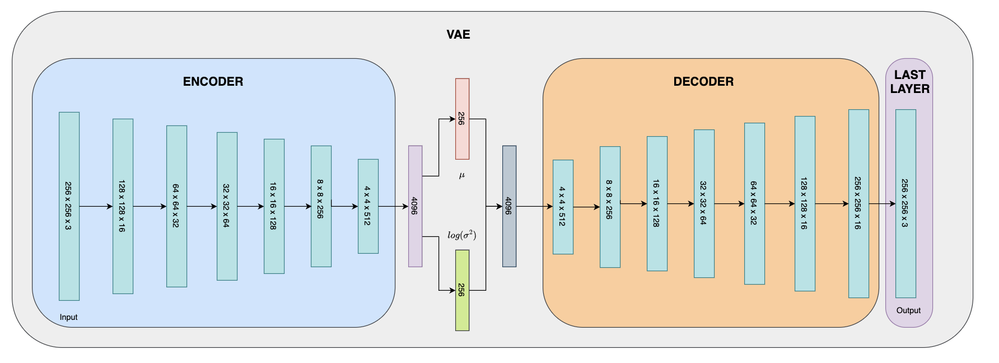
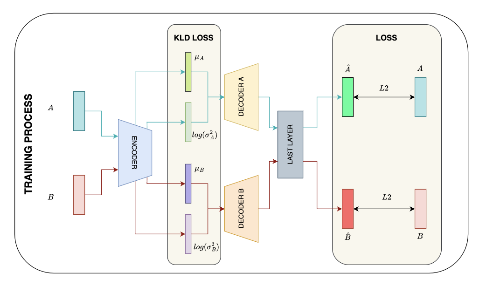
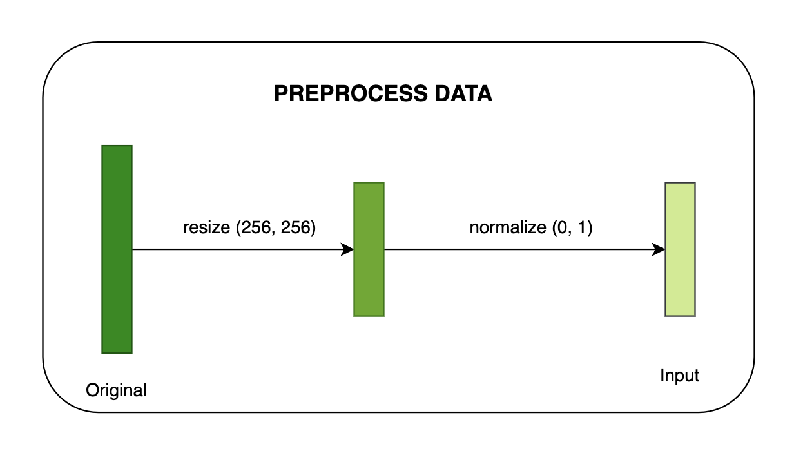

# FaceSwap with VAE

## Architecture


## Training process


## Preprocess after feed to model


## Data
Save data of any user in a new folder in `data` folder.

## Preprocess data
RUN:
```
python preprocessing.py --input_folder=path_to_image_folder

Usage example: python preprocessing.py --input_folder=./data/hai
```
After run above command, a new folder named `cropped_faces_[user]` is created in `data`. This folder is used to provide data for training process.

## Training
Replace `checkpoint_folder`, `sample_folder`, `first_user`, `second_user` in  `config.yaml` file with your paths.

RUN:
```
python train.py
```

## Inference
Replace `checkpoint_path` in `config.yaml` file with path to your checkpoint.

RUN:
```
python inference.py --image_path=path_to_image

Usage example: python inference.py --image_path=./data/hai/1.jpg
```

A new image will be created and saved in the same folder with name consisting `_result` string.

Example:

